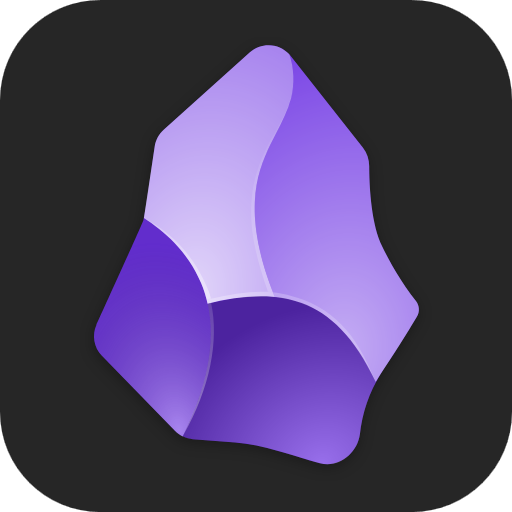
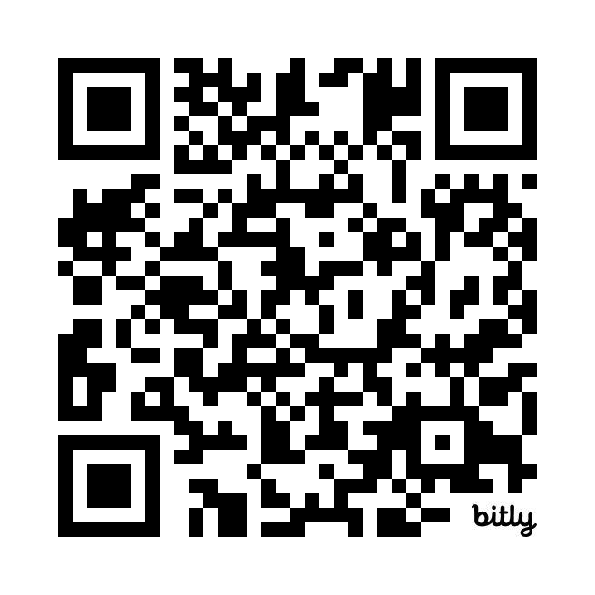

# Graduate Toolkit Mastery:
## Planning, Monitoring, and Project Management for Success

---

# About this series

In these workshops, you will:
* Learn about program and project management for graduate students.
* Create a monitoring and evaluation plan for your studies.
* Organize all your school knowledge and projects in one place.

---


# Who am I?

My name is Typo, but some people call me Damian.

I am an incoming PhD student in Education.

I have some experience in grad school, both great and not so great.

---

# Why these workshops?

Your grad school experience is greatly affected by how you organize your schoolwork.

Unfortunately, very few of us graduate students get to invest time developing grad school-specific skills. After all, it's just a few years, right?

I created a methodology to help me streamline all areas of grad school, and I believe it can be useful to all of my colleagues.

---

# What does this methodology involve?

* Creating a writing and knowledge ecosystem that grows with you and your studies.
* Writing two small documents to monitor and evaluate your progress. These will also get molded by you as your grad school experience moves forward. 
* Using tried-and-true project management tools for your academic activities.

---

# Questions I have received so far

1. I understand you will show us the tools you work with. Can we use our own tools though?
2. Do we need to come to all three of these workshops?
3. I am already in the middle of my studies. Will this methodology still apply to me?

---

<!-- _class: lead-->


# Organize your grad school life: Tools and strategies

---

# Today's plan

I'll show you all the pieces of the machinery for how I manage my academic journey.

We'll also cover:
1. A very broad overview of key tools like *Theories of Change* and *Logic Models*.
2. The tools I use to manage my projects.
3. A practice called "Chunk Writing".

---

# A writing and knowledge ecosystem

In my previous experiences as a grad student, I used to:
1. Have a folder on my computer for every semester.
2. Create a folder for every class.
3. Have a folder for every assistantship.
* And I kept adding folders as needed.

---

## It would look like this:

```
MyGradFolder/
├── semester1
│   ├── class1... notes, pdfs, research...
│   ├── class2... notes, pdfs, research...
│   ├── class3... notes, pdfs, research...
│   └── TAship
├── semester2
│   ├── class1... notes, pdfs, research...
│   ├── class2... notes, pdfs, etc...
│   └── TAship
├── semester3... class1, class2, etc...
└── Exams, Dissertation, Own research, etc...
    └── ...
```

---

<!-- _class: lead-->

## What is the problem?

* **In this way, your knowledge gets siloed**.

---

# Today I organize my knowledge like so:

```
MyGradFolder
├── 0_chunks
├── 1_templates
├── 2_topics
├── 3_sources
└── 4_notes
```

---

# How is this different?

1. All of the folders besides `chunks` and `notes` are functional.
2. The bulk of my knowledge goes into my `notes`:

---

# How is this different?

1. All of the folders besides `chunks` and `notes` are functional.
2. The bulk of my knowledge goes into my `notes`:

```
MyGradFolder
├── 0_chunks
├── 1_templates
├── 2_topics
├── 3_sources
└── **4_notes**
```
---

# Do you need more folders? No problem!

```
 MyGradFolder
├── 0_chunks
├── 1_templates
├── 2_topics
├── 3_sources
├── 4_notes
└── **5_dissertation**
    ├── **chapter1**
    └── **chapter2 ...**

```

---

# Or you could do this:

```
 MyGradFolder
├── 0_chunks
├── 1_templates
├── **3_other**
├── **4_etc...**
├── 5_topics
├── 6_sources
└── 7_notes
```

* Questions?

---

<!-- _class: lead-->

# The secret sauce:



## [Obsidian](https://obsidian.md/)

* A note taking app that lets you sort all of your knowledge in a single place. 
* It is free, designed by two very talented women, and available for all platforms.
* With Obsidian, you are the sole owner of your work.

---

# What is chunk writing?

* Take a single document
* Pick a topic or a thought that has been on your mind
* Write without editing
* Write only what is on your mind without looking at source material

---

# There are two stages:

1. Write your chunks
2. Sort your chunks

Your writing will emerge from these.

**Let's practice**

---

<!-- _class: lead -->

## [https://bit.ly/3VTmkgG](https://bit.ly/3VTmkgG)



---

# Next: Monitoring and evaluation

Program monitoring and evaluation is a systematic discipline focused on assessing the design, implementation, and outcomes of programs to improve effectiveness, ensure accountability, and inform decision-making.

---

# What is a Theory of Change?

A Theory of Change is a comprehensive framework that outlines the process of achieving a long-term goal by identifying the necessary preconditions, interventions, and causal linkages.

---

# What is a Logic Model?

A Logic Model is a visual representation that maps out the resources, activities, outputs, and outcomes of a program to illustrate the logical sequence and connections between these components in achieving the program's goals.

---

# Project management tools for your academic activities

Let's take a look at three different project management tools that companies use to deliver goods and services around the world.

* Project Roadmaps
* Kanban Boards
* GitHub Repositories

GitHub offers project roadmaps and kanban boards for free.

---

# Next time

We will focus on program monitoring and evaluation (M&E) strategies. Specifically, we'll:

- Discuss how to effectively plan your graduate journey.
- Share and set our objectives.
- Create a personalized **Theory of Change** and **Logic Model**.

---

# Resources

Will be sent to you later today. Please drop your emails in the chat!

---

# **Thank you!**
