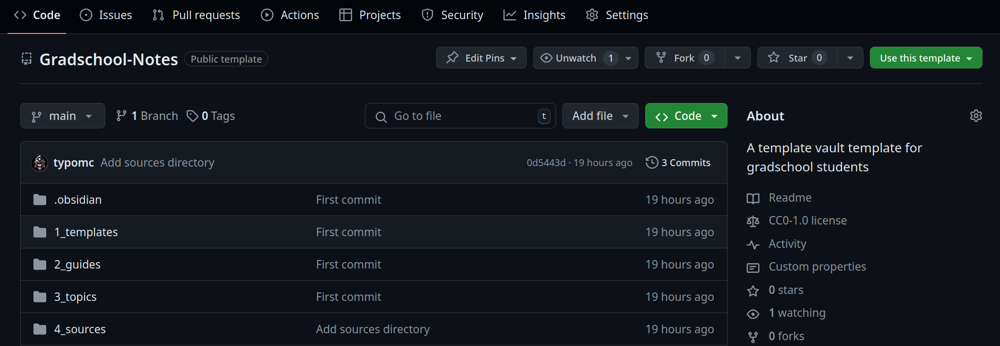

## Graduate Toolkit Mastery:
# Planning, Monitoring, and Project Management for Success

##### *-Typo, PhD Student*

---

<!-- _class: lead-->

## Part 3

# Get Your Hands Dirty: Hands-on Practice with GitHub and Obsidian

---

# Assumptions

1) You have created two GitHub accounts
2) You have downloaded and played around with Obsidian
3) You now know what Markdown is and you know its basics
4) You are working on your computer, not a tablet

---

<!-- _class: title -->

# GitHub

---

## We'll learn:

1) To create a new repository
2) To create README files
3) What are issues and how to create them
4) Using GitHub Projects
5) Browsing GitHub

---

<!-- _class: title -->

# Obsidian

---

# Getting our Obsidian vault started

* Download the Vault 
* Explore the Vault
* Explore the Settings
* Core and Community plugins
* Aesthetics
* Hotkeys
* Usage

---

# I. Downloading the vault

Go to the following link and click on the `Use this template` button on the right.

### [https://github.com/Lenguita-AI/Gradschool-Notes](https://github.com/Lenguita-AI/Gradschool-Notes)

---
 
# II. Let's open Obsidian and explore our new vault

* There are pre-made folders for you
* There are some files already created too
* There are guides and templates
* You will see tags already there for you

---

# III. Settings and customizing our vault

* General: Automatic updates and language
* Editor: Strict line breaks, folding, line numbers, spellcheck
* Files and links: Auto update links, default location for new notes,use Wikilinks, attachment folder path

---

# IV. Core and Community plugins

* Core: Backlinks, Bookmarks, Canvas, Command Palette, Search, Templates
* Community: Git and Natural Language Dates

---
 
# V. Aesthetics

* Settings: Dark or white mode
* Settings:Community themes
* The Obsidian layout
* Left and right menus
* Reading mode vs Editing mode

---

# VI. Hotkeys

* Add alias
* Close current tab
* Close window
* Command Palette
* Create new note
* Follow link under cursor
* Insert markdown link
* Undo close tab
 
---

# VII. Organization

* Create folders
* Enable templates
* Add aliases
* Add tags
* Add topics
* Naming conventions
* Create your first note!

---

<!-- _class: title -->

# GitHub + Obsidian

---

## I. The Git/GitHub part

1) Download Git from [https://git-scm.com/downloads](https://git-scm.com/downloads)
2) Create a [Personal Access Token](https://docs.github.com/en/authentication/keeping-your-account-and-data-secure/managing-your-personal-access-tokens#creating-a-personal-access-token-classic)
3) Copy and paste that Personal Access Token. Save it. Do not share it.

* 

---

### To finish with this part let's create a text we'll use later:

* https://PERSONAL_ACCESS_TOKEN@github.com/USERNAME/REPO.git

For example, mine will be this:

* https://PERSONAL_ACCESS_TOKEN@github.com/TypoMC/Gradschool-Notes.git

---

## II. The Obsidian part

1) Install the Git plugin
2) Copy to your clipboard that text we created in the last slide
3) Open the Command Palette
4) In the Command Palette type **Clone the existing remote repo**
5) Paste the text that was in your clipboard and press Enter

---

# Resources
- [About Kanban Boards](https://www.atlassian.com/agile/kanban/boards)
- [The Easiest Way to Set Up Obsidian Git](https://forum.obsidian.md/t/the-easiest-way-to-setup-obsidian-git-to-backup-notes/51429)
- [Creating a personal access token in GitHub](https://docs.github.com/en/authentication/keeping-your-account-and-data-secure/managing-your-personal-access-tokens#creating-a-personal-access-token-classic)
- [Obsidian Help](https://help.obsidian.md/Home)
- [Obsidian Multiple Cursors Plugin](https://github.com/SkepticMystic/advanced-cursors) for people who like to use more than one cursor like in Sublime Text and VS Code.
- [Add Due Date Notifications to a GitHub Repository](https://github.com/marketplace/actions/due-date-notifications-via-comments)

---

<!-- _class: title -->

# **Thank you!**
